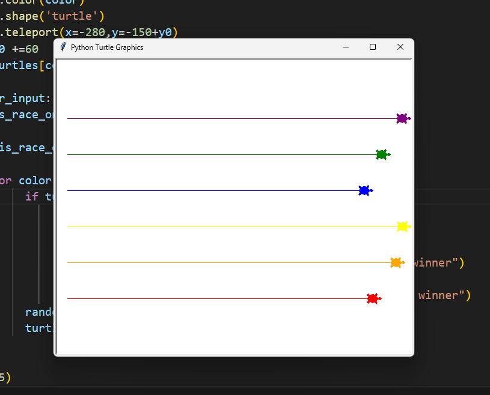

Turtle Race Game
his is a simple and fun turtle race game built using Python's turtle module. The user places a bet on which colored turtle will win the race. Each turtle moves forward by a random amount on each turn, making the outcome unpredictable.

This project is part of the 100 Days of Code:Python 3 on Udemy.

📌 Features
Six colorful turtles line up for a race.

User can place a bet through a popup input.

Random movement for each turtle to simulate a real race.

Announces the winner and whether the user won or lost.

🎮 Controls
Enter a color (e.g., "red", "blue", "green") when prompted.

Click the turtle screen to exit after the race ends.
## 🖼️ Screenshot

